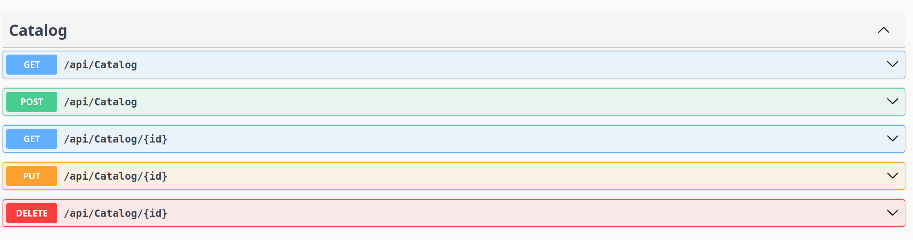

# **CRUD API with MongoDB and ASP.NET Core Tutorial**

This project demonstrates how to build a simple **CRUD (Create, Read, Update, Delete)** API with **MongoDB** using **ASP.NET Core**.

Web API is a key part of building a CRUD API. It is a way to create an ASP.NET application specifically adapted to work in the REST (Representational State Transfer) style. It facilitates communication between the client and the server by transferring data in XML and JSON formats. Services that use the REST architecture are called RESTful services.

The CRUD operations correspond to the following HTTP methods in REST:
- **GET**: Read data (retrieve from a list).
- **POST**: Create new data.
- **PUT**: Update existing data.
- **DELETE**: Remove specific data.

---

## **Prerequisites**

1. **ASP.NET Core SDK**
2. **MongoDB**
3. **Visual Studio Code** or any preferred IDE

---

## **Steps to Set Up the Project**

### **1. Create and Open the Project**
```bash
dotnet new webapi -o CatalogApi
cd CatalogApi
code .
```

### **2. Install MongoDB Driver**
```bash
dotnet add package MongoDB.Driver
```

### **3. Add the Product Model**
- Create a folder named `Models` and add a file `Product.cs`:
    ```csharp
    using MongoDB.Bson;
    using MongoDB.Bson.Serialization.Attributes;

    namespace CatalogApi.Models;

    public class Product
    {
        [BsonId]
        [BsonRepresentation(BsonType.ObjectId)]
        public string Id { get; set; } = null!;
        
        [BsonElement("name")]
        public string Name { get; set; } = null!;
        
        public required decimal Price { get; set; }
        public required string Category { get; set; } = null!;
        public required string Description { get; set; } = null!;
    }
    ```

### **4. Configure Database Connection**
- Update the `appsettings.json` file:
    ```json
    {
      "DatabaseSettings": {
        "ConnectionString": "mongodb://localhost:27017",
        "DatabaseName": "ProductDb",
        "CatalogCollectionName": "Products"
      },
      "Logging": {
        "LogLevel": {
          "Default": "Information",
          "Microsoft.AspNetCore": "Warning"
        }
      },
      "AllowedHosts": "*"
    }
    ```

### **5. Create Database Service**
- Add a service to handle database operations in `Services/CatalogsService.cs`:
    ```csharp
    using CatalogApi.Models;
    using Microsoft.Extensions.Options;
    using MongoDB.Driver;

    namespace CatalogApi.Services;

    public class CatalogsService
    {
          private readonly IMongoCollection<Product> _productsCollection;
          
          public CatalogsService(IOptions<CatalogDbSettings> catalogDbSettings)
          {
            if (catalogDbSettings == null)
                throw new ArgumentNullException(nameof(catalogDbSettings));
            if (string.IsNullOrEmpty(catalogDbSettings.Value.ConnectionString))
                throw new ArgumentException("Connection string is not configured.");
          
            var mongoClient = new MongoClient(catalogDbSettings.Value.ConnectionString);
          
            var mongoDatabase = mongoClient.GetDatabase(catalogDbSettings.Value.DatabaseName);
          
            _productsCollection = mongoDatabase.GetCollection<Product>(
                catalogDbSettings.Value.CatalogCollectionName);
          }
          
          public async Task<List<Product>> GetProductsAsync()
          {
            return await _productsCollection.Find(p => true).ToListAsync();
          }
          
          public async Task<Product?> GetProductByIdAsync(string id)
          {
             return await _productsCollection.Find(p => p.Id == id).FirstOrDefaultAsync();
          }
          
          public async Task CreateProductAsync(Product product)
          {
             await _productsCollection.InsertOneAsync(product);
          }
          
          public async Task UpdateProductAsync(string id, Product product)
          {
             await _productsCollection.ReplaceOneAsync(p => p.Id == id, product);
          }
          
          public async Task RemoveProductAsync(string id)
          {
             await _productsCollection.DeleteOneAsync(p => p.Id == id);
          }
    }
    ```

### **6. Add Controller**
- Add an API controller for handling CRUD operations in `Controllers/CatalogController.cs`:
    ```csharp
    using CatalogApi.Models;
    using CatalogApi.Services;
    using Microsoft.AspNetCore.Mvc;

    namespace CatalogApi.Controllers;

    [ApiController]
    [Route("api/[controller]")]
    public class CatalogController : ControllerBase
    {
        private readonly CatalogsService _catalogsService;

        public CatalogController(CatalogsService catalogsService)
        {
            _catalogsService = catalogsService;
        }

        [HttpGet]
        public async Task<List<Product>> GetProductsAsync() =>
            await _catalogsService.GetProductsAsync();

        [HttpGet("{id:length(24)}", Name = "GetProductByIdAsync")]
        public async Task<ActionResult<Product>> GetProductByIdAsync(string id)
        {
            var product = await _catalogsService.GetProductByIdAsync(id);

            if (product is null)
                return NotFound();

            return product;
        }

        [HttpPost]
        public async Task<IActionResult> CreateProductAsync(Product product)
        {
            await _catalogsService.CreateProductAsync(product);

            return CreatedAtRoute("GetProductByIdAsync", new { id = product.Id }, product);
        }

        [HttpPut("{id:length(24)}")]
        public async Task<IActionResult> UpdateProductAsync(string id, Product updatedProduct)
        {
            var product = await _catalogsService.GetProductByIdAsync(id);

            if (product is null)
                return NotFound();

            updatedProduct.Id = product.Id;

            await _catalogsService.UpdateProductAsync(id, updatedProduct);

            return NoContent();
        }

        [HttpDelete("{id:length(24)}")]
        public async Task<IActionResult> DeleteProductAsync(string id)
        {
            var product = await _catalogsService.GetProductByIdAsync(id);

            if (product is null)
                return NotFound();

            await _catalogsService.RemoveProductAsync(id);

            return NoContent();
        }
    }
    ```
  ### **7. Configurations in the Program.cs file**
  ```csharp
    // Importing namespaces for models and services
    using CatalogApi.Models;
    using CatalogApi.Services;
    
    // Initialize the builder for the web application
    var builder = WebApplication.CreateBuilder(args);
    
    // Configure database settings from the configuration file
    builder.Services.Configure<CatalogDbSettings>(
    builder.Configuration.GetSection("CatalogDbSettings"));
    
    // Register the CatalogsService to handle database operations as a singleton
    builder.Services.AddSingleton<CatalogsService>();
    
    // Add support for API controllers
    builder.Services.AddControllers();
    
    // Enable API endpoint exploration (used by Swagger to generate docs)
    builder.Services.AddEndpointsApiExplorer();
    
    // Configure Swagger to generate and display API documentation
    builder.Services.AddSwaggerGen();
    
    // Build the application based on the defined configurations
    var app = builder.Build();
    
    // Check if the environment is set to development
    if (app.Environment.IsDevelopment())
    {
    // Enable Swagger UI for testing the API in development mode
    app.UseSwagger();
    app.UseSwaggerUI();
    }
    
    // Redirect all HTTP requests to HTTPS
    app.UseHttpsRedirection();
    
    // Enable authorization for accessing protected API endpoints
    app.UseAuthorization();
    
    // Map API controllers to handle incoming requests
    app.MapControllers();
    
    // Run the application
    app.Run();
  ```
---
  ### **Build and run**
  ```bash
       dotnet run
  ```
  - Go to http://localhost:5074/swagger/index.html
---

